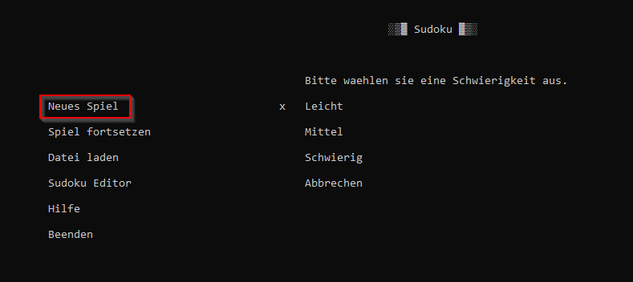
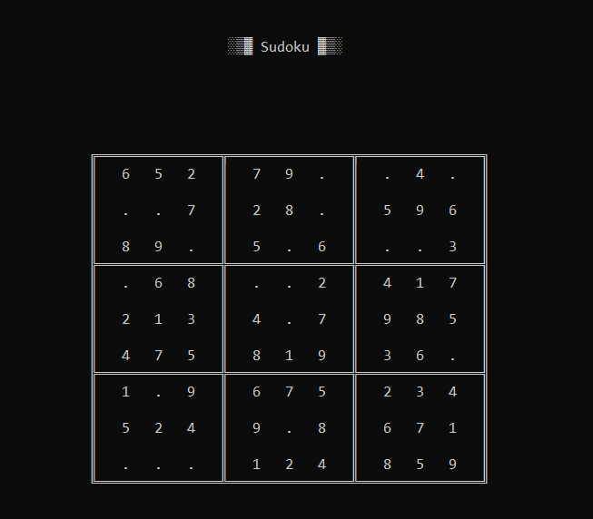
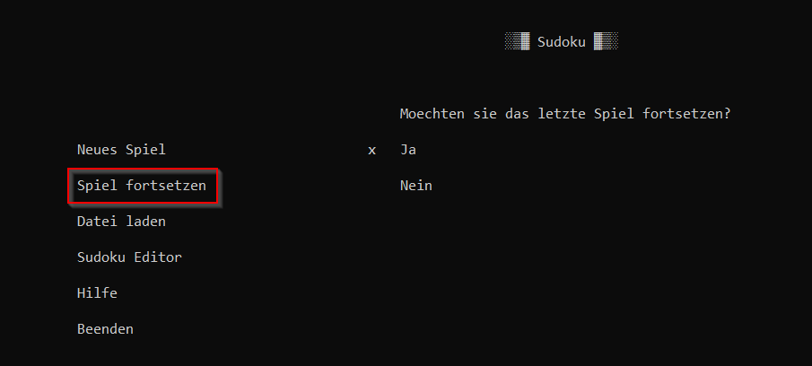
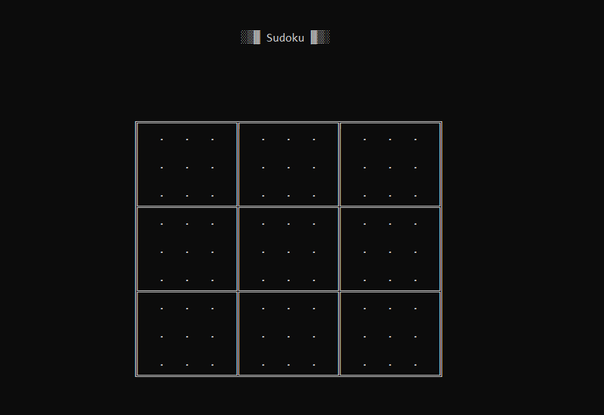
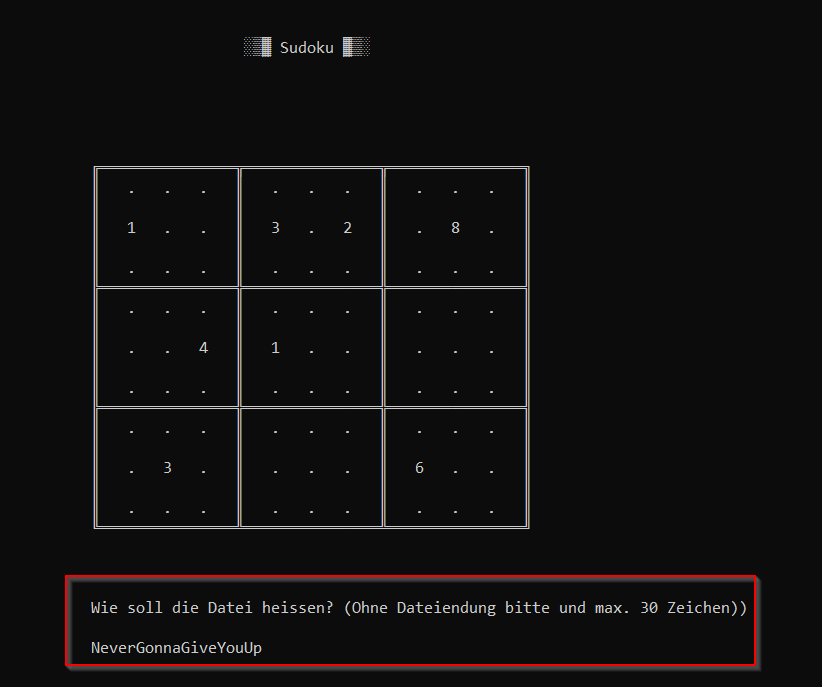

# Spielanleitung

# Menü
Im Menü gibt es verschiedene Optionen, die man auswählen kann. Die Navigation erfolgt über die Pfeil-Tasten, die Enter-Taste (bestätigen) und die Escape-Taste (Abbrechen / beenden).

## Neues Spiel
Wählt man "Neues Spiel", erscheint ein Menü mit einer Auswahl von Schwierigkeiten:
<figure></figure>
Nach Auswahl wird automatisch ein zufälliges Sudoku generiert (im Bild beispielsweise ein leichtes):
<figure></figure>
Die Schwierigkeitsgrade bedeuten:

- *Leicht*: 20 Zahlen fehlen
- *Mittel*: 35 Zahlen fehlen
- *Schwierig*: 50 Zahlen fehlen

## Spiel fortsetzen
Zunächst erfolgt eine Abfrage, ob das letzte gespeicherte Spiel geladen werden soll:
<figure></figure>
Wird diese mit ja bestätigt, wird das letzte Spiel geladen.

## Datei laden
Eine Liste von 50 gespeicherten Spielen wird angezeigt. Nach Auswahl wird das entsprechende Spiel geladen.

## Sudoku Editor
Ein leeres Sudoku wird angezeigt, in das der / die SpielerIn ein eigenes Spiel schreiben kann:
<figure></figure>
Wenn das Spiel eingetragen ist und der / die SpielerIn Escape drückt, muss er / sie noch einen Namen eingeben:
<figure></figure>
Das eingegebene Sudoku wird nach Eingabe durch Enter als Datei abgespeichert und man gelangt wieder in das Hauptmenü.

# Spielmodi

# Sudoku Regeln

# Sudoku spielen
